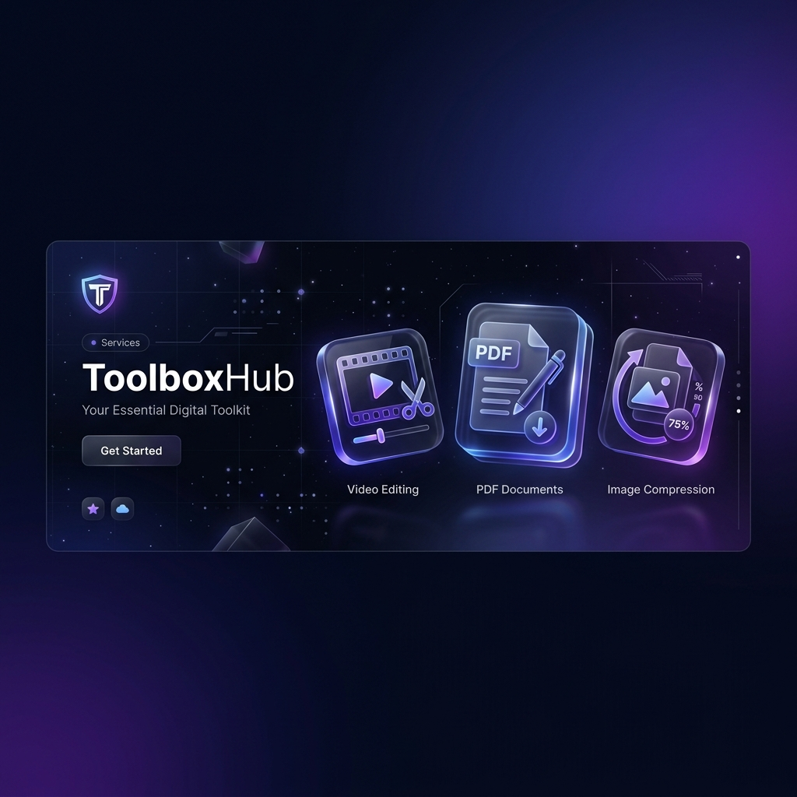

# 🛠️ ToolboxHub — Your Essential Digital Toolkit



**ToolboxHub** is a high-performance, modular web application designed to consolidate essential digital tools into a single, sleek "Liquid Glass" interface. From AI-powered video clipping to advanced PDF manipulation, ToolboxHub is built for speed, privacy, and aesthetic excellence.

---

## 🚀 Core Features

### 🪄 Text Remover (AI Inpainting)
Restore your media by surgically removing unwanted text, watermarks, or overlays.
- **AI Inpainting**: Reconstructs background textures using OpenCV's Deep Telea algorithm.
- **Smart Banner Detection**: Automatically detects and encompasses text background bars, icons, and containers.
- **Manual Mask Tool**: Pixel-perfect manual drawing tool for custom removal regions.
- **Video & Thumbnail Support**: Professional-grade cleanup for video frames and social media thumbnails.

### 🕒 Coming Soon
- **🖼️ Image Compressor**: Lossless and lossy batch compression.
- **🔍 SEO Analyzer**: Instant meta-data and performance auditing.

---

## 🛠️ Technology Stack

### Frontend
- **Framework**: Next.js 14 (App Router)
- **Styling**: Tailwind CSS & Vanilla CSS (Liquid Glass Ecosystem)
- **Icons**: Lucide React
- **State**: Zustand
- **API**: Axios with modular services

### Backend
- **Engine**: FastAPI (Python 3.10+)
- **Database**: SQLite with SQLAlchemy ORM
- **Media Processing**: PyMuPDF, pypdf, faster-whisper, yt-dlp
- **AI Integration**: OpenRouter (Qwen-2.5 Model)

---

## ⚙️ Installation

### 1. Clone the Repository
```bash
git clone https://github.com/starkbbk/ToolBoxHub.git
cd ToolBoxHub
```

### 2. Backend Setup
```bash
cd backend
python -m venv venv
source venv/bin/activate  # Mac/Linux
pip install -r requirements.txt
cp .env.example .env     # Add your OPENROUTER_API_KEY
python main.py
```

### 3. Frontend Setup
```bash
cd frontend
npm install
npm run dev
```

---

## 🧬 Project Structure

```text
ToolboxHub/
├── backend/
│   ├── tools/
│   │   ├── clipmaster/      # Video processing module
│   │   ├── pdf_converter/   # PDF manipulation module
│   │   └── compressor/      # (Coming Soon)
│   ├── main.py              # Single-entry router
│   └── database.py          # Shared state & persistence
└── frontend/
    ├── src/
    │   ├── app/             # Responsive pages
    │   ├── components/      # Glassmorphism UI components
    │   └── lib/             # Typed API & store
    └── tailwind.config.ts   # Design system tokens
```

---

## 🛡️ Privacy & Performance
- **Local First**: Files are processed in secure temporary directories.
- **Async Execution**: Heavy tasks (Video/PDF) run in the background with live UI updates.
- **Modular Code**: Every tool is isolated, allowing for infinite scalability.

---

## 📜 License
Internal Project - All Rights Reserved.

---
*Built with ❤️ for the modern digital workspace.*
